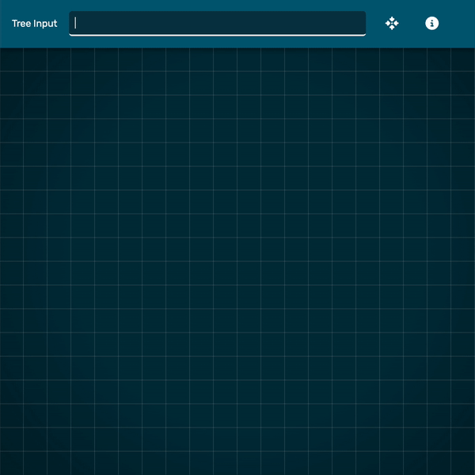

# Binary Tree Visualization

A simple web application to visualize a binary tree given it's level order string representation.

## Working

To space out the nodes, a simple algorithm is used where the positions of the leaf nodes in the last level are calculated by equally spacing them by a constant factor. In this calculation, the null nodes are also considered as if they were present in the representation of a <b>fully complete binary tree</b> of the same height.

## Running Locally

Node is required to run the project locally. To run locally,

1. Clone the repository.
2. Run `yarn` or `npm i` (if using npm) in the root directory of the project.
3. Start the development server using `yarn start` or `npm start`.

By default, parcel serves the app at `http://localhost:1234`

Build the project using `yarn build` or `npm build`.
